**TRƯỜNG ĐẠI HỌC GIAO THÔNG VẬN TẢI**

**KHOA ĐIỆN - ĐIỆN TỬ**

**BỘ MÔN ĐIỀU KHIỂN HỌC**

> ------------------------------🙡🕮🙣------------------------------

**BÁO CÁO KẾT THÚC HỌC PHẦN**

**Hệ Thống Điều Khiển Chuyển Động Tàu Metro**

**Lớp môn tín chỉ (Thời khóa biểu):**

**Hệ thống điều khiển chuyển động tàu metro (N01)**

**Người hướng dẫn: PGS.TS Trịnh Lương Miên**

**Thời gian thi: 25/11/2003**

**Sinh viên thực hiện: Hồ Hồng Quân**

**Mã sinh viên: 211602127**

**Lớp: Kỹ sư kỹ thuật điều khiển và tự động hóa 2**

**Hà Nội, tháng 11 năm 2025**

**TRƯỜNG ĐẠI HỌC GIAO THÔNG VẬN TẢI**

**KHOA ĐIỆN - ĐIỆN TỬ**

**BỘ MÔN ĐIỀU KHIỂN HỌC**

> ------------------------------🙡🕮🙣------------------------------

**BÁO CÁO KẾT THÚC HỌC PHẦN**

**Hệ Thống Điều Khiển Chuyển Động Tàu Metro**

**Lớp môn tín chỉ (Thời khóa biểu):**

**Hệ thống điều khiển chuyển động tàu metro (N01)**

**Người hướng dẫn: PGS.TS Trịnh Lương Miên**

**Thời gian thi: 25/11/2003**

**Sinh viên thực hiện: Hồ Hồng Quân**

**Mã sinh viên: 211602127**

**Lớp: Kỹ sư kỹ thuật điều khiển và tự động hóa 2**

**Hà Nội, tháng 11 năm 2025**

# MỤC LỤC

[DANH MỤC CÁC KÝ HIỆU, CHỮ VIẾT TẮT [4](#danh-mục-các-ký-hiệu-chữ-viết-tắt)](#danh-mục-các-ký-hiệu-chữ-viết-tắt)

[DANH MỤC CÁC HÌNH VẼ, ĐỒ THỊ [5](#danh-mục-các-hình-vẽ-đồ-thị)](#danh-mục-các-hình-vẽ-đồ-thị)

[PHẦN I: LÝ THUYẾT (CÂU 1 VÀ CÂU2) [6](#phần-i-lý-thuyết-câu-1-và-câu-2)](#phần-i-lý-thuyết-câu-1-và-câu-2)

[Câu 1: Trình bày các sơ đồ khối cấu trúc hệ thống điều khiển chuyển động tàu điện metro trên khu gian trên tuyến đường sắt đô thị? Cho biết vai trò, chức năng của các thành phần trong hệ thống? [6](#câu-1-trình-bày-các-sơ-đồ-khối-cấu-trúc-hệ-thống-điều-khiển-chuyển-động-tàu-điện-metro-trên-khu-gian-trên-tuyến-đường-sắt-đô-thị-cho-biết-vai-trò-chức-năng-của-các-thành-phần-trong-hệ-thống)](#câu-1-trình-bày-các-sơ-đồ-khối-cấu-trúc-hệ-thống-điều-khiển-chuyển-động-tàu-điện-metro-trên-khu-gian-trên-tuyến-đường-sắt-đô-thị-cho-biết-vai-trò-chức-năng-của-các-thành-phần-trong-hệ-thống)

[Câu 2: Anh/Chị hãy đưa ra các nhận xét và minh họa bằng sơ đồ, hình ảnh cho thấy sự liên kết thông tin tín hiệu điều khiển chặt chẽ giữa phân hệ chức năng thiết bị của hệ thống điều khiển giám sát chạy tàu trên khu gian trên tuyến 2A Cát Linh - Hà Đông/ tuyến 3.1 Nhồn - Cầu Giấy [12](#câu-2-anhchị-hãy-đưa-ra-các-nhận-xét-và-minh-họa-bằng-sơ-đồ-hình-ảnh-cho-thấy-sự-liên-kết-thông-tin-tín-hiệu-điều-khiển-chặt-chẽ-giữa-phân-hệ-chức-năng-thiết-bị-của-hệ-thống-điều-khiển-giám-sát-chạy-tàu-trên-khu-gian-trên-tuyến-2a-cát-linh---hà-đông-tuyến-3.1-nhồn---cầu-giấy)](#câu-2-anhchị-hãy-đưa-ra-các-nhận-xét-và-minh-họa-bằng-sơ-đồ-hình-ảnh-cho-thấy-sự-liên-kết-thông-tin-tín-hiệu-điều-khiển-chặt-chẽ-giữa-phân-hệ-chức-năng-thiết-bị-của-hệ-thống-điều-khiển-giám-sát-chạy-tàu-trên-khu-gian-trên-tuyến-2a-cát-linh---hà-đông-tuyến-3.1-nhồn---cầu-giấy)

[PHẦN 2: BÀI TẬP ỨNG DỤNG KHẢO SÁT ĐOÀN TÀU ĐIỆN METRO [16](#phần-2-bài-tập-ứng-dụng-khảo-sát-đoàn-tàu-điện-metro)](#phần-2-bài-tập-ứng-dụng-khảo-sát-đoàn-tàu-điện-metro)

[Câu 3. Khảo sát đoàn tàu điện metro (MUTC) chạy trên khu gian (RUTC) có thông số đường ray [16](#_Toc214827038)](#_Toc214827038)

[I. Phương trình chuyển động của đoàn tàu metro [16](#i.-phương-trình-chuyển-động-của-đoàn-tàu-metro)](#i.-phương-trình-chuyển-động-của-đoàn-tàu-metro)

[II. Các phương trình liên tục và sai phân tính quỹ đạo chạy tàu (tính toán theo công thức Euler) [18](#ii.-các-phương-trình-liên-tục-và-sai-phân-tính-quỹ-đạo-chạy-tàu-tính-toán-theo-công-thức-euler)](#ii.-các-phương-trình-liên-tục-và-sai-phân-tính-quỹ-đạo-chạy-tàu-tính-toán-theo-công-thức-euler)

[III. Thuật toán tối ưu năng lượng quỹ đạo chạy của đoàn tàu [20](#iii.-thuật-toán-tối-ưu-năng-lượng-quỹ-đạo-chạy-của-đoàn-tàu)](#iii.-thuật-toán-tối-ưu-năng-lượng-quỹ-đạo-chạy-của-đoàn-tàu)

[IV. Chương trình code [21](#iv.-chương-trình-code-rightarrow-v_max-53kmh)](#iv.-chương-trình-code-rightarrow-v_max-53kmh)

#  

# DANH MỤC CÁC KÝ HIỆU, CHỮ VIẾT TẮT

- ATC (Automatic Train Control) - Tự động điều khiển chạy tàu

- ATP (Automatic Train Protection) - Tự động bảo vệ đoàn tàu

- ATO (Automatic Train Operation) - Tự động lái tàu

- ATS (Automatic Train Supervision) - Tự động giám sát đoàn tàu

- CTC (Centralized Traffic Control) - Điều khiển chạy tàu tập trung

- CBI (Computer Based Interlocking) - Liên khóa máy tính

- DMI (Driver Machine Interface) - Giao diện người lái

- OCC (Operations Control Center) - Trung tâm điều hành khai thác

- OBC (On-Board Controller) - Bộ điều khiển trên tàu

- TCMS (Train Control and Management System) - Hệ thống điều khiển và quản lý tàu

## DANH MỤC CÁC HÌNH VẼ, ĐỒ THỊ

Hình 1: Sơ đồ cấu trúc điều khiển chuyển động tàu điện metro

Hình 1.1. Sơ đồ theo Phân cấp thiết bị.

Hình 1.2. Phân cấp theo Nhóm Chức năng Điều khiển.

Hình 2.1. Phương án 4 (ATS+ATP+ATO)

Hình 2.2. Sơ đồ Vòng Điều khiển Trung tâm (ATS - Giám sát & Điều độ)

Hình 2.3. Sơ đồ Vòng Điều khiển Chạy tàu (ATP & ATO)

# PHẦN I: LÝ THUYẾT (CÂU 1 VÀ CÂU 2)

## Câu 1: Trình bày các sơ đồ khối cấu trúc hệ thống điều khiển chuyển động tàu điện metro trên khu gian trên tuyến đường sắt đô thị? Cho biết vai trò, chức năng của các thành phần trong hệ thống?

1.1. Theo phân cấp thiết bị, gồm: thiết bị trung tâm điều khiển giám sát chạy tàu, thiết bị nhà ga, thiết bị trên tàu

1.2. Theo nhóm chức năng điều khiển, gồm: vòng điều khiển trung tâm và vòng điều khiển chạy tàu trên khu gian trên tuyên.

Bài Làm:

Hệ thống điều khiển chuyển động tàu điện metro trên khu gian (hay còn gọi là khu đoạn giữa các ga) thường được thiết kế dựa trên Hệ thống Điều khiển Tàu Tự động (Automatic Train Control - ATC). Hệ thống ATC này được chia thành ba hệ thống con chính là ATS (Giám sát – Khống chế Tự động Đoàn tàu), ATP (Tự động Phòng hộ Đoàn tàu), và ATO (Vận hành Tự động Đoàn tàu).

Sơ đồ cấu trúc điều khiển:

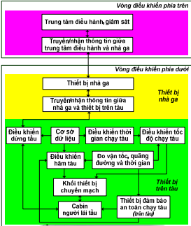

Hình 1: Sơ đồ cấu trúc điều khiển chuyển động tàu điện metro

- Vòng điều khiển phía trên - Cấp Quản lý

> \- Trung tâm điều hành, giám sát (OCC): Lập biểu đồ chạy tàu, giám sát vị trí toàn bộ các tàu trên tuyến, ra lệnh điều chỉnh giãn cách hoặc xử lý sự cố
>
> \- Truyền/nhận thông tin giữa trung tâm và nhà ga là mạng truyền dẫn (Backbone). Truyền lệnh từ OCC xuống các ga và nhận dữ liệu báo cáo từ các ga về OCC.

- Vòng điều khiển phía dưới - Cấp Trung gian

> \- Phần Nhà ga là cấp độ điều khiển khu vực và truyền tin (tương đương thiết bị Wayside).

- Vai trò: Trạm trung chuyển và xử lý an toàn khu vực. Nhận lệnh từ trung tâm, xử lý logic liên khóa (CBI) để đảm bảo đường ray an toàn, sau đó chuyển tiếp lệnh cho tàu.

- Truyền/nhận thông tin giữa nhà ga và thiết bị trên tàu:

<!-- -->

- Vai trò: Kênh giao tiếp Đất - Tàu (có thể là sóng vô tuyến hoặc mạch điện đường ray). Gửi lệnh cho phép di chuyển (Movement Authority) xuống tàu và nhận vị trí tàu gửi lên.

\- Phần Trên tàu ( Cấp Thực thi) là phần phức tạp nhất trong sơ đồ, mô tả chi tiết kiến trúc bên trong của hệ thống OBC (On-board Controller), bao gồm cả ATP và ATO.

- Nhóm Xử lý dữ liệu & Tính toán:

<!-- -->

- Lưu trữ bản đồ số của tuyến đường (độ dốc, khúc cua, vị trí nhà ga, giới hạn tốc độ tĩnh).

- Sử dụng các cảm biến tốc độ (tacho-generator) hoặc radar để biết tàu đang chạy bao nhiêu km/h và đã đi được bao xa.

- Tính toán xem tàu nên chạy nhanh hay chậm để đến ga đúng giờ, điều khiển tốc độ chạy tàu.

<!-- -->

- Nhóm Thực thi & An toàn:

<!-- -->

- Chức năng của ATO để đảm bảo tàu dừng chính xác tại ke ga (sai số vài chục cm) để cửa tàu khớp với cửa ga.

- Ra lệnh cho hệ thống phanh (khí nén hoặc điện) hoạt động dựa trên yêu cầu giảm tốc hoặc dừng.

- Thiết bị đảm bảo an toàn chạy tàu (ATP) giám sát độc lập. Nếu các khối điều khiển tốc độ phía trên gặp lỗi hoặc tàu chạy quá tốc độ cho phép, khối này sẽ can thiệp trực tiếp để phanh khẩn cấp.

<!-- -->

- Khối thiết bị chuyển mạch: Giao tiếp phần cứng, chuyển đổi tín hiệu điện tử từ máy tính sang tín hiệu điện lực để điều khiển động cơ/phanh.

- Cabin người lái tàu (Driver Interface - DMI): Màn hình hiển thị cho lái tàu biết tốc độ, chế độ lái (Auto/Manual) và các cảnh báo. Cho phép lái tàu can thiệp khi cần thiết.

<!-- -->

- 

1.1 Phân cấp theo Thiết bị

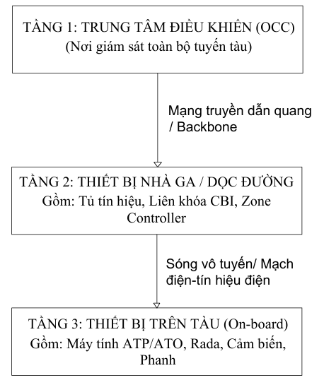

Hình 1.1. Sơ đồ theo Phân cấp thiết bị.

1\. Thiết bị Trung tâm Điều khiển Giám sát Chạy tàu (CTC/ATS)

Thiết bị trung tâm được đặt tại Trung tâm Điều hành (OCC), thường nằm trong khu vực Depot.

| Thành phần              | Vai trò và Chức năng                                                                                                                                                                                                                                           |
|-------------------------|----------------------------------------------------------------------------------------------------------------------------------------------------------------------------------------------------------------------------------------------------------------|
| Hệ thống ATS (Giám sát) | Chức năng cốt lõi của Trung tâm điều hành. Quản lý và giám sát vận hành của đoàn tàu, tự động hóa công tác chạy tàu. ATS thực hiện phân biệt và theo dõi tự động các đoàn tàu, tự động xử lý xác lập hành trình, và thiết lập/quản lý bảng thời gian chạy tàu. |
| Thiết bị phần cứng      | Bao gồm mạng LAN, hệ thống máy tính trung tâm (dự phòng), đài khống chế (bàn điều khiển), bảng hiển thị.                                                                                                                                                       |
| Điều khiển              | Khống chế tập trung tự động là chính. CTC/ATS có khả năng điều khiển tập trung toàn tuyến hoặc chuyển sang chế độ điều khiển cục bộ tại các ga khi cần.                                                                                                        |

2\. Thiết bị Nhà ga và Tuyến (Interlocking - CI và ATP Lineside)

| Thành phần                 | Vai trò và Chức năng                                                                                                                                                                                                                                                                                     |
|----------------------------|----------------------------------------------------------------------------------------------------------------------------------------------------------------------------------------------------------------------------------------------------------------------------------------------------------|
| Hệ thống Liên khóa Ga (CI) | Thiết bị liên khóa ga trên cơ sở vi điều khiển (máy tính). CI hoạt động trên nguyên tắc kiểm tra – điều khiển – kiểm tra – đưa ra quyết định, thực hiện liên khóa ghi – đường chạy – tín hiệu – đoàn tàu. Chức năng chính là thiết lập đường chạy an toàn cho tàu vào ga và tự động hiển thị trạng thái. |
| ATP Thiết bị trên mặt đất  | Bao gồm Mạch điện đường ray xoay chiều âm tần không mối cách điện (dùng để xác định vị trí tàu và truyền thông tin). Các đơn vị ATP trên tuyến (Lineside) nhận mã tốc độ từ khối trước, lập và gửi mã tốc độ đến tàu phía sau.                                                                           |

3\. Thiết bị trên Tàu (ATP On-board và ATO)

Các thiết bị trên tàu thực hiện chức năng kiểm soát an toàn (ATP) và vận hành tự động (ATO), thường được tích hợp và quản lý bởi Hệ thống Kiểm soát và Giám sát Tàu (TCMS).

| Thành phần                                 | Vai trò và Chức năng                                                                                                                                                                                                                                                                      |
|--------------------------------------------|-------------------------------------------------------------------------------------------------------------------------------------------------------------------------------------------------------------------------------------------------------------------------------------------|
| Hệ thống ATP trên tàu                      | Thiết bị thu mã tốc độ từ thanh ray, các khối xử lý tín hiệu và thiết bị phát xung biểu thị tốc độ. ATP xác định tốc độ tối đa an toàn và nếu tàu vượt quá tốc độ, ATP sẽ điều khiển hãm thường hoặc hãm khẩn cấp.                                                                        |
| Hệ thống ATO trên tàu                      | Tự động điều khiển đoàn tàu vận hành trong khu gian. Chức năng quan trọng nhất là điều khiển tự động đoàn tàu dừng tại vị trí xác định trên ke ga với độ chính xác không quá 0.5 m. ATO tự động lựa chọn phương án tối ưu để đoàn tàu vận hành đảm bảo tính kinh tế tối ưu (Eco-driving). |
| TCMS (Hệ thống điều khiển và giám sát tàu) | Là "bộ não và xương sống truyền thông" của đoàn tàu, tích hợp và quản lý tất cả thông tin trên tàu, đưa ra quyết định điều khiển tàu, và tích hợp các hệ thống con khác nhau. TCMS đang chuyển từ mạng MVB/WTB sang mạng Ethernet dựa trên ECN/ETB để tăng thông lượng thông tin.         |

1.2. Phân cấp theo Nhóm Chức năng Điều khiển (Vòng Điều khiển)

Hệ thống ATC hoạt động dựa trên sự phối hợp giữa hai vòng điều khiển chính:

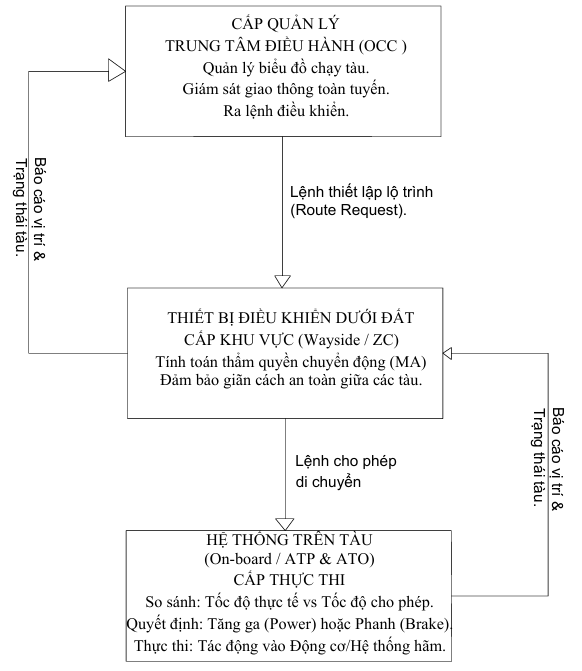

Hình 1.2. Phân cấp theo Nhóm Chức năng Điều khiển.

1\. Vòng Điều khiển Trung tâm (ATS - Giám sát và Điều độ)

Vòng này chịu trách nhiệm cho các quyết định cấp cao, không liên quan trực tiếp đến an toàn tức thời mà tập trung vào tối ưu hóa vận hành và lịch trình.

• Đầu vào: Vị trí đoàn tàu (nhận từ ATP/tàu), trạng thái thiết bị trên tuyến, biểu đồ chạy tàu.

• Xử lý: ATS thực hiện giám sát (Giám sát quá trình vận hành các đoàn tàu) và điều độ (Thiết lập và quản lý bảng thời gian chạy tàu, tự động xử lý xác lập hành trình).

• Đầu ra: ATS đưa ra các lệnh điều chỉnh chế độ vận hành cho đoàn tàu (gửi đến ATO) và các chỉ dẫn cho điều độ viên.

• Vai trò chính: Tự động hóa công tác chạy tàu và đảm bảo đoàn tàu tuân thủ lịch trình.

2\. Vòng Điều khiển Chạy tàu trên Khu gian (ATP & ATO - An toàn và Vận hành)

Vòng này hoạt động theo thời gian thực (real-time), nơi chức năng ATP đảm bảo an toàn tuyệt đối, còn ATO đảm bảo vận hành tối ưu trong giới hạn an toàn đó.

A. ATP (Vòng An toàn/Phòng hộ):

• Chức năng: Khống chế giãn cách an toàn giữa các đoàn tàu và phòng ngừa vượt quá tốc độ cho phép.

• Nguyên tắc hoạt động trên khu gian:

    ◦ Mặt đất (Lineside): Các đơn vị ATP trên tuyến truyền mã tốc độ ATP thông qua thanh ray, mang tin tức về tốc độ an toàn cho khu đoạn phía trước.

    ◦ Trên tàu: Thiết bị trên tàu nhận mã này, so sánh tốc độ thực tế của tàu với Đường cong hãm tiêu chuẩn (Standard Braking Curve) và Giới hạn an toàn (Safety margin) để xác định tốc độ tối đa cho phép.

    ◦ Phòng hộ: Nếu tốc độ tàu vượt quá giới hạn an toàn, ATP sẽ kích hoạt hãm.

B. ATO (Vòng Tối ưu hóa/Vận hành):

• Chức năng: Thực hiện việc điều khiển lực kéo/lực hãm để tàu chạy tự động.

• Nguyên tắc hoạt động trên khu gian: ATO nhận giới hạn tốc độ an toàn từ ATP và chế độ vận hành từ ATS. Dựa trên các thông số này, ATO tính toán và điều khiển lực kéo/hãm để đoàn tàu vận hành đảm bảo tính kinh tế tối ưu (chạy tàu sinh thái). ATO cũng điều khiển tàu dừng chính xác tại vị trí ga.

Tương tác giữa các vòng: ATO phải hoạt động trong giới hạn an toàn do ATP thiết lập. Nếu ATO không thể điều khiển tàu tuân thủ tốc độ an toàn, ATP sẽ can thiệp để hãm khẩn cấp.

Các Hệ thống Điều khiển Chuyển động Tàu Điện Metro Tiên tiến (CBTC/Moving Block)

Đối với các tuyến metro hiện đại đòi hỏi giãn cách cực ngắn (dưới 90 giây), hệ thống ATC có thể được nâng cấp thành ATC Chuẩn bị Di động hoặc ATC Đóng đường Di động (Moving Block).

• ATC Chuẩn bị Di động: Vẫn là hệ thống đóng đường kiểu cố định nhưng sử dụng mạch điện đường ray không tấm cách điện và tín hiệu số hóa. Hệ thống này khống chế tốc độ theo đường cong liên tục, có thể giảm giãn cách đến 90 giây.

• ATC Đóng đường Di động (Moving Block): Hệ thống này loại bỏ phân khu đóng đường cố định, sử dụng nguyên lý khoảng cách phanh tuyệt đối. Nó yêu cầu thông tin hai chiều liên tục giữa tàu và mặt đất bằng sóng vô tuyến. Giãn cách giữa hai đoàn tàu có thể rút xuống còn 60 giây.

## Câu 2: Anh/Chị hãy đưa ra các nhận xét và minh họa bằng sơ đồ, hình ảnh cho thấy sự liên kết thông tin tín hiệu điều khiển chặt chẽ giữa phân hệ chức năng thiết bị của hệ thống điều khiển giám sát chạy tàu trên khu gian trên tuyến 2A Cát Linh - Hà Đông/ tuyến 3.1 Nhồn - Cầu Giấy

Bài làm

Dự án đường sắt đô thị Cát Linh – Hà Đông (Tuyến 2A) là tuyến đường đôi, chạy tàu bên phải, với yêu cầu giãn cách tối thiểu trong tương lai là khoảng 2 phút. Để đáp ứng mật độ khai thác cao này, hệ thống điều khiển giám sát chạy tàu được kiến nghị sử dụng là Hệ thống Điều khiển Tàu Tự động (Automatic Train Control - ATC).

Hệ thống ATC bao gồm ba phân hệ chức năng chính: ATS (Giám sát – Khống chế Tự động Đoàn tàu), ATP (Tự động Phòng hộ Đoàn tàu), và ATO (Vận hành Tự động Đoàn tàu).

I. Minh họa Sơ đồ khối Liên kết Thông tin Tín hiệu

Sơ đồ khối chức năng tổng quát của hệ thống tín hiệu hiện đại (ATC), điển hình được sử dụng cho tuyến Cát Linh – Hà Đông (Phương án 4), minh họa sự liên kết thông tin chặt chẽ giữa các phân hệ chức năng, đặc biệt là trên khu gian giữa các ga:

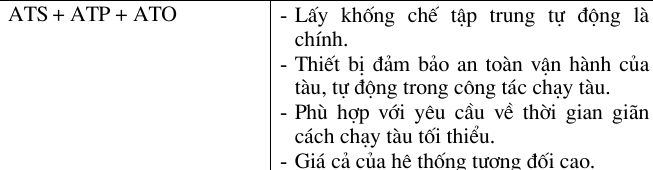

Hình 2.1. Phương án 4( ATS+ATP+ATO)

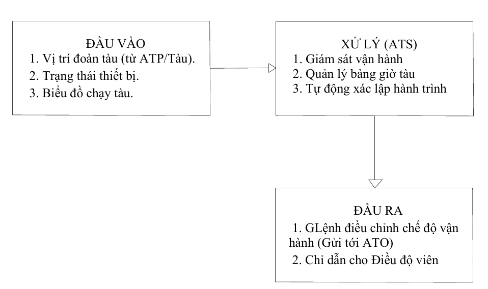1. Sơ đồ Vòng Điều khiển Trung tâm (ATS - Giám sát & Điều độ)

Hình 2.2. Sơ đồ Vòng Điều khiển Trung tâm (ATS - Giám sát & Điều độ)

2\. Sơ đồ Vòng Điều khiển Chạy tàu (ATP & ATO)

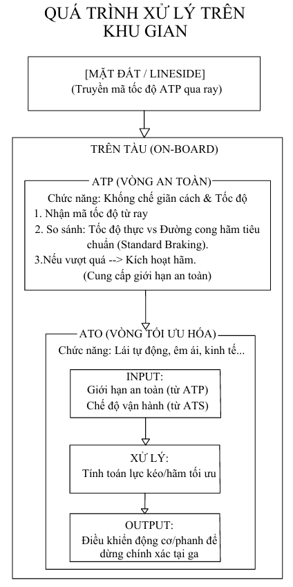

Hình 2.3. Sơ đồ Vòng Điều khiển Chạy tàu (ATP & ATO)

- Nhận xét:

<!-- -->

- Sơ đồ Vòng Điều khiển Trung tâm là vòng quản lý cấp cao, không can thiệp trực tiếp vào an toàn tức thời mà tập trung vào lịch trình.

- Sơ đồ Vòng Điều khiển Chạy tàu: Vòng này hoạt động thời gian thực (Real-time)

| Vị trí        | Thiết bị/Phân hệ                              | Liên kết thông tin                                                      |
|---------------|-----------------------------------------------|-------------------------------------------------------------------------|
| Trung tâm     | CTC (ATS)                                     | Gửi Lệnh từ ATS xuống các đơn vị điều khiển ATP.                        |
| Trên tuyến    | Đơn vị điều khiển ATP (tại các khối/phân khu) | Nhận Số liệu từ khối trước và truyền/gửi Mã tốc độ ATP về tàu phía sau. |
| Trên tuyến    | Điểm ATO                                      | Các điểm trên tuyến mà hệ thống ATO thực hiện các tác nghiệp tự động.   |
| Tàu/Đường ray | Vị trí đoàn tàu                               | Cung cấp thông tin liên tục về vị trí đoàn tàu (cho cả ATS và ATP).     |

Cấu trúc này cho thấy các hệ thống con ATS, ATP, và ATO trao đổi thông tin theo các chiều của các mũi tên, tạo thành hệ thống tự động đảm bảo tối ưu hóa các tác nghiệp chạy tàu.

II\. Nhận xét về Sự Liên kết Thông tin Tín hiệu Chặt chẽ

Sự liên kết thông tin giữa ATS, ATP, và ATO trên khu gian là chặt chẽ và mang tính thứ bậc, trong đó ATP là vòng điều khiển an toàn tuyệt đối chi phối hai vòng còn lại.

1\. Liên kết An toàn tuyệt đối (ATP chi phối ATO)

Phân hệ ATP chịu trách nhiệm đảm bảo an toàn cơ bản và là giới hạn vật lý đối với mọi chuyển động của tàu.

• Truyền tải Mã tốc độ: Trên khu gian, ATP mặt đất sử dụng mạch điện đường ray xoay chiều âm tần, không mối cách điện (phương án 4 sử dụng loại này). Mã tốc độ ATP mang tin tức về tốc độ tối đa an toàn được truyền qua thanh ray đến thiết bị trên tàu.

• Thiết bị Trên tàu: Thiết bị ATP trên tàu nhận mã này, xác định tốc độ tối đa an toàn (Max Safe Speed). ATP so sánh tốc độ thực tế của tàu với Đường cong hãm tiêu chuẩn (Standard Braking Curve) và Giới hạn an toàn (Safety margin).

• Khống chế Vận hành: Nếu tàu vượt quá tốc độ an toàn được phép, ATP sẽ tự động điều khiển hãm thường hoặc hãm khẩn cấp.

• Vai trò của ATO: Hệ thống ATO (Vận hành Tự động) có chức năng điều khiển lực kéo/lực hãm để tối ưu hóa vận hành (đảm bảo tính kinh tế tối ưu). Tuy nhiên, ATO bắt buộc phải vận hành trong giới hạn tốc độ do ATP thiết lập và giám sát. ATO thực hiện điều khiển vận hành, nhưng ATP mới là hệ thống đảm bảo an toàn tuyệt đối.

Nhận xét: Liên kết này mang tính phòng hộ tối cao. Mọi quyết định vận hành (tăng tốc, chạy quán tính, hãm) của ATO trên khu gian đều bị giám sát và có thể bị phủ quyết (hãm khẩn cấp) bởi ATP nếu vi phạm giới hạn an toàn.

2\. Liên kết Điều độ và Tối ưu hóa (ATS chi phối ATO)

Phân hệ ATS hoạt động ở Trung tâm điều hành (CTC) và cung cấp các lệnh cấp cao cần thiết cho ATO thực hiện nhiệm vụ theo lịch trình.

• Giám sát và Lập lệnh: ATS thực hiện phân biệt và txheo dõi tự động các đoàn tàu, tự động xử lý xác lập hành trình. ATS thiết lập và quản lý bảng thời gian chạy tàu.

• Điều chỉnh Chế độ: ATS đưa ra các chỉ dẫn và điều chỉnh các chế độ vận hành của đoàn tàu (Lệnh từ ATS). Lệnh này hướng dẫn ATO thực hiện chạy tàu để tuân thủ lịch trình và đạt tính kinh tế tối ưu.

• Phản hồi Vị trí: ATS nhận Vị trí đoàn tàu liên tục từ tàu và các đơn vị ATP trên tuyến để giám sát quá trình vận hành.

Nhận xét: Liên kết này mang tính điều độ và tối ưu. ATS là "bộ não" lập kế hoạch, ATO là "chân tay" thực hiện kế hoạch đó trên khu gian, trong khi ATP là "cảnh sát" đảm bảo việc thực hiện là an toàn.

3\. Liên kết Nội tại trên Tàu (TCMS)

Mặc dù các nguồn tài liệu đề cập đến ATC (ATS+ATP+ATO) cho tuyến Cát Linh – Hà Đông, nhưng sự liên kết vật lý và dữ liệu trên tàu được quản lý bởi Hệ thống Điều khiển và Giám sát Tàu (TCMS).

• TCMS là "bộ não và xương sống truyền thông" của đoàn tàu, tích hợp và quản lý tất cả thông tin trên tàu, đưa ra quyết định điều khiển và tích hợp các hệ thống con khác nhau.

• Trong hệ thống TCMS thế hệ mới (NG-TCMS) đang được nghiên cứu và phát triển, mục tiêu là có khả năng thực hiện các chức năng SIL4 (Mức độ Toàn vẹn An toàn cấp 4), loại bỏ các đường truyền an toàn vật lý và tích hợp thiết bị của các miền khác nhau trên tàu. Điều này cho thấy xu hướng tăng cường sự liên kết và tích hợp chức năng an toàn (ATP) và vận hành (ATO) ngay trong kiến trúc trên tàu (On-board systems).

• Việc tích hợp NG-TCMS với các hệ thống khác trên tàu, như X2Rail (ATO) và OCORA (CCS), cho thấy mục tiêu là đồng bộ hóa các tiêu chuẩn mạng lưới để đảm bảo khả năng tương thích và truyền thông giữa các hệ thống điều khiển vận hành.

# PHẦN 2: BÀI TẬP ỨNG DỤNG KHẢO SÁT ĐOÀN TÀU ĐIỆN METRO

Câu 3. Khảo sát đoàn tàu điện metro (MUTC) chạy trên khu gian (RUTC) có thông số đường ray như bảng dưới:

| Độ dốc ray        | 0.15 | -1.35 | -3.15 | 0   | 1.55 | 0.15 |
|-------------------|------|-------|-------|-----|------|------|
| Chiều dài ray (m) | 200  | 200   | 150   | 200 | 200  | 150  |

Biết đoàn tàu gồm 4 toa sử dụng 32 guốc hãm, lực ép guốc hãm 4.5 tấn

Lực cản chính xác định theo Davis:  
w₀(v) = a + *b*v + *c*v²,

Trong đó:

a = 6.543; b = 0.05432; c = 0.00105.

### I. Phương trình chuyển động của đoàn tàu metro

1.1. Hệ phương trình chuyển động của đoàn tàu metro

Ta có hệ phương trình vi phân chuyển động của đoàn tàu metro

$$\left\{ \begin{array}{r}
\frac{dt}{ds} = \frac{3.6}{v}\ \ \ \ \ \ \ \ \ \ \ \ \ \ \ \ \ \ \ \ \ \ \ \ \ \ \ \ \ \ \ \ \ \ \ \ \ \ \ \ \ \ \ \ \ \ \ \ \ \ \ \ \ \ \ \ \ \ \ \ \ \ \ \ \ \ \ \ \ \ \ \ \ \ \ \ \ \ \ \ \ \ \ \ \ \ \  \\
\frac{dv}{ds} = \frac{u_{f}f_{m}(v) - u_{r}r_{m}(v) - u_{b}b_{m}(v) - w_{0}(v) - w_{g}(s)}{v}
\end{array} \right.\ 
$$Đặt a *=*${\ u}_{f}f_{m}(v) - u_{r}r_{m}(v) - u_{b}b_{m}(v) - w_{0}(v) - w_{g}(s)$ (1)

$f_{m} = \frac{F_{m}(v)}{(1 + \gamma)m}$ ${\ \ \ \ \ \ \ \ r}_{m} = \frac{R_{m}(v)}{(1 + \gamma)m}$ ${\ \ \ \ \ \ \ \ b}_{m} = \frac{B_{m}(v)}{(1 + \gamma)m}{\ \ \ \ \ \ \ \ \ w}_{0} = \frac{W_{0}(v)}{(1 + \gamma)m}{\ \ \ \ \ \ \ \ \ w}_{g} = \frac{W_{g}(v)}{(1 + \gamma)m}$

Theo CT: $v = \int_{}^{}{a.ds/v}$  
Nếu các khoảng $\mathrm{\Delta}S\ \left( s_{k + 1} - s_{k} \right)đủ\ nhỏ,$ khi đó ta có thể coi $a_{k} \approx a$.  
$$\left\{ \begin{array}{r}
v_{k + 1} = \sqrt{v_{k}^{2} + 2a_{k}(s_{k + 1} - s_{k})} \\
t_{k + 1} = t_{k} + \frac{7.2(s_{k + 1} - s_{k})}{v_{k + 1} + v_{k}}
\end{array} \right.\ 
$$

1.2. Phương trình tính lực kéo đoàn tàu $F_{m}(v)$  
Từ đường đặc tính chạy tàu với trọng tải lớn nhất, áp dụng xấp xỉ hàm theo bình phương cực tiểu ta có được phương trình tính lực kéo của đoàn tàu:  
$$F_{m}(v) = \left\{ \begin{array}{r}
\begin{matrix}
13.5\ \ \ \ \ \ \ \ \ \ \ \ \ \ \ \ \ \ \ \ \ \ \ \ \ \ \ \ \ \ \ \ \ \ \ \ \ \ \ \ \ \ \ \ \ \ \ \ \ \ \ \ \ \ \ \ \ \ \ \ \ \ \ \ \ \ \ \ \ \ \ \ \ \ \ \ \ 0 \leq v \leq 32 \\
0.0063v^{2} - 0.7721v + 31.6515\ \ \ \ \ \ \ \ \ \ \ \ \ \ \ \ \ \ \ \ \ \ \ 32 \leq v \leq 50\ 
\end{matrix} \\
\begin{matrix}
0.0028v^{2} - 0.474v + 25.4574\ \ \ \ \ \ \ \ \ \ \ \ \ \ \ \ \ \ \ \ \ \ \ \ \ 50 \leq v \leq 70\  \\
\begin{matrix}
0.003v^{2} - 0.537v + 29.01\ \ \ \ \ \ \ \ \ \ \ \ \ \ \ \ \ \ \ \ \ \ \ \ \ \ \ \ \ \ \ 70 \leq v \leq 80\  \\
 - 0.0714v + 10.95\ \ \ \ \ \ \ \ \ \ \ \ \ \ \ \ \ \ \ \ \ \ \ \ \ \ \ \ \ \ \ \ \ \ \ \ \ \ \ \ \ \ \ \ \ \ \ 80 \leq v \leq 100\ 
\end{matrix}
\end{matrix}
\end{array} \right.\ 
$$<!-- -->1.3 Phương trình lực hãm đoàn tàu $R_{m}(v)$**  
**Từ đường đặc tính chạy tàu với trọng tải lớn nhất, áp dụng xấp xỉ hàm theo bình phương cực tiểu ta có được phương trình tính lực hãm của đoàn tàu:  
$$R_{m}(v) = \left\{ \begin{array}{r}
\begin{matrix}
0\ \ \ \ \ \ \ \ \ \ \ \ \ \ \ \ \ \ \ \ \ \ \ \ \ \ \ \ \ \ \ \ \ \ \ \ \ \ \ \ \ \ \ \ \ \ \ \ \ \ \ \ \ \ \ \ \ \ \ \ \ \ \ \ \ \ \ \ \ \ \ \ \ \ \ 0 \leq v \leq 5 \\
6v - 30\ \ \ \ \ \ \ \ \ \ \ \ \ \ \ \ \ \ \ \ \ \ \ \ \ \ \ \ \ \ \ \ \ \ \ \ \ \ \ \ \ \ \ \ \ \ \ \ \ \ \ \ \ \ \ \ \ \ \ \ \ \ \ \ \ 5 \leq v \leq 7.5\ 
\end{matrix} \\
\begin{matrix}
 - 0.24v + 30.2\ \ \ \ \ \ \ \ \ \ \ \ \ \ \ \ \ \ \ \ \ \ \ \ \ \ \ \ \ \ \ \ \ \ \ \ \ \ \ \ \ \ \ \ \ \ \ \ \ \ \ \ 7.5 \leq v \leq 65\  \\
\begin{matrix}
 - 0.2037v + 27.4667\ \ \ \ \ \ \ \ \ \ \ \ \ \ \ \ \ \ \ \ \ \ \ \ \ \ \ \ \ \ \ \ \ \ \ \ \ \ \ \ 65 \leq v \leq 75\  \\
 - 0.007v + 15.0522\ \ \ \ \ \ \ \ \ \ \ \ \ \ \ \ \ \ \ \ \ \ \ \ \ \ \ \ \ \ \ \ \ \ \ \ \ \ \ \ \ 75 \leq v \leq 100\ 
\end{matrix}
\end{matrix}
\end{array} \right.\ 
$$<!-- -->1.4. Phương trình tính lực hãm cơ khí của đoàn tàu $B_{m}(v)$**  
**$$B_{m}(v) = 1000\sum_{k = 1}^{n}{k.\varphi_{k}}
$$Với:

k: Lực ép của guốc hãm

n: Số guốc hãm  
$$\varphi_{k} = \frac{0.6(16k + 100)}{80k + 100}.\frac{v + 100}{5v + 100}
$$Theo đề bài đoàn tàu có 4 toa sử dụng n=32 guốc hãm, k=4,5\[T\]  
$$\rightarrow B_{m}(v) = 48.93\frac{v + 100}{5v + 100}
$$<!-- -->1.5. Phương trình tính lực cản chính của đoàn tàu $W_{0}(v)$

Công thức tính lực cản chính của đoàn tàu:  
$$w_{0}(v) = a + MSV*b*v + MSV*c*v^{2}$$

MSV: **2116021<u>27</u>**; a=6.543; b=0.05432; c=0.00105  
Ta tính được$:\ w_{0}(v) = 6.543 + 27*0.05432*v + 27*0.00105*v^{2}$  
$$\rightarrow w_{0}(v) = 6.543 + 1.46664v + 0.02835v^{2}
$$

1.6. Phương trình tính lực cản phụ của đoàn tàu $W_{g}(s)$**  
**Lực cản này sinh ra do độ dốc của đường ray tàu

| Độ dốc ray    | 0.15 | -1.35 | -3.15 | 0   | 1.55 | 0.15 |
|---------------|------|-------|-------|-----|------|------|
| Chiều dài ray | 200  | 200   | 150   | 100 | 200  | 150  |

Giả sử $k_{R} = 700,\ R = 500m$  
$w_{\mathbf{g}}(s)$ $= i(s) + \frac{k_{R}}{R}$**  
**Với:

$i(s):\ độ\ dốc\ \%$o  
$k_{R}$ là hệ số tính toán lực cản cong của đường ray  
R là bán kính cong của đường ray  
Theo đề bài: $W_{g}(s) = \left\{ \begin{array}{r}
\begin{matrix}
1.55\ \ \ \ \ \ \ \ \ \ \ \ \ \ \ \ \ \ \ \ \ \ \ \ \ \ \ \ \ \ \ \ \ \ \ \ \ \ \ \ \ \ \ \ \ \ \ \ 0 \leq v \leq 200 \\
0.05\ \ \ \ \ \ \ \ \ \ \ \ \ \ \ \ \ \ \ \ \ \ \ \ \ \ \ \ \ \ \ \ \ \ \ \ \ \ \ \ \ \ \ \ 200 \leq v \leq 400\ 
\end{matrix} \\
\begin{matrix}
 - 1.75\ \ \ \ \ \ \ \ \ \ \ \ \ \ \ \ \ \ \ \ \ \ \ \ \ \ \ \ \ \ \ \ \ \ \ \ \ \ \ \ \ \ \ \ 400 \leq v \leq 550\  \\
\begin{matrix}
\ \ \ \ 1.4\ \ \ \ \ \ \ \ \ \ \ \ \ \ \ \ \ \ \ \ \ \ \ \ \ \ \ \ \ \ \ \ \ \ \ \ \ \ \ \ \ \ \ \ \ \ \ \ \ 550 \leq v \leq 650\  \\
\begin{matrix}
2.95\ \ \ \ \ \ \ \ \ \ \ \ \ \ \ \ \ \ \ \ \ \ \ \ \ \ \ \ \ \ \ \ \ \ \ \ \ \ \ \ \ \ \ \ \ \ 650 \leq v \leq 850 \\
\ \ 1.55\ \ \ \ \ \ \ \ \ \ \ \ \ \ \ \ \ \ \ \ \ \ \ \ \ \ \ \ \ \ \ \ \ \ \ \ \ \ \ \ \ \ \ \ \ \ 850 \leq v \leq 1000
\end{matrix}
\end{matrix}
\end{matrix}
\end{array} \right.\ $**  
**

### II. Các phương trình liên tục và sai phân tính quỹ đạo chạy tàu (tính toán theo công thức Euler)

2.1. Chế độ lực kéo cực đại LK

Ta thấy rằng chế độ LK bắt đầu từ ga đầu tiên của khu gian nên ở chế độ này có $v_{0} = 0$,$\ s_{0} = 0$. Chế độ lực kéo này sẽ kết thúc khi vận tốc cuối bằng với vận tốc cho trước.

Theo công thức (1), ở chế độ này có $u_{f} = 1,u_{r} = u_{b} = 0$.  
Vậy a = $f_{m}(v) - w_{0}(v) - w_{g}(s)$  
$${s_{k + 1} = s_{k} + \mathrm{\Delta}s
}{\begin{array}{r}
v_{k + 1} = \sqrt{v_{k}^{2} + 2a_{k}(s_{k + 1} - s_{k})} \\
 = \sqrt{v_{k}^{2} + (f_{m}(v) - w_{0}(v) - w_{g}(s)).\mathrm{\Delta}s} \\
t_{k + 1} = t_{k} + \frac{7.2\mathrm{\Delta}s}{v_{k + 1} + v_{k}}
\end{array}
}$$

2.2. Chế độ ổn tốc độ lực kéo OK  
Ở chế độ này tàu metro chuyển động với vận tốc ổn định với $v_{OK}$ cho trước.

2.3 Chế độ chạy quán tính QT  
Chế độ QT bắt đầu sau chế độ LK hoặc OK, vì vậy điểm bắt đầu của chế này có thể là bất kỳ ở vị trí nào sau quãng đường LK đã chạy. Do đó ta sẽ thu được nhiều quỹ đạo chạy QT.  
Từ công thức (1), ở chế độ này có $u_{f} = u_{r} = u_{b} = 0$  
Vậy a = $- w_{0}(v) - w_{g}(s)$  
$${s_{k + 1} = s_{k} + \mathrm{\Delta}s
}{\begin{array}{r}
v_{k + 1} = \sqrt{v_{k}^{2} + 2a_{k}(s_{k + 1} - s_{k})} \\
 = \sqrt{v_{k}^{2} + ( - w_{0}(v) - w_{g}(s)).\mathrm{\Delta}s} \\
t_{k + 1} = t_{k} + \frac{7.2\mathrm{\Delta}s}{v_{k + 1} + v_{k}}
\end{array}
}$$<!-- -->2.4 Chế độ hãm điện cực đại  
Điểm bắt đầu của chế độ này là điểm cuối cùng của QT. Chế độ HĐ kết thúc khi vận tốc giảm đến giá trị cho trước để có thể dừng hẳn trong chế độ tiếp theo.  
Từ công thức (1), ở chế độ này có $u_{f} = 0,\ u_{r} = 1,\ u_{b} = 0$  
Vậy a = $- \ r_{m} - w_{0}(v) - w_{g}(s)$  
$${s_{k + 1} = s_{k} + \mathrm{\Delta}s
}{\begin{array}{r}
v_{k + 1} = \sqrt{v_{k}^{2} + 2a_{k}(s_{k + 1} - s_{k})} \\
 = \sqrt{v_{k}^{2} + ( - \ r_{m} - w_{0}(v) - w_{g}(s)).\mathrm{\Delta}s} \\
t_{k + 1} = t_{k} + \frac{7.2\mathrm{\Delta}s}{v_{k + 1} + v_{k}}
\end{array}
}$$<!-- -->2.5 Chế độ hãm cơ khí

Chế độ này sẽ bắt đầu sau khi chế độ hãm điện cực đại kết thúc và nó sẽ kết thúc khi vận tốc của tàu bằng 0.  
Từ công thức (1), ở chế độ này có $u_{f} = 0,\ u_{r} = 0,\ u_{b} = 1$  
Vậy a = $- \ b_{m} - w_{0}(v) - w_{g}(s)$

$${s_{k + 1} = s_{k} + \mathrm{\Delta}s
}{\begin{array}{r}
v_{k + 1} = \sqrt{v_{k}^{2} + 2a_{k}(s_{k + 1} - s_{k})} \\
 = \sqrt{v_{k}^{2} + ( - b_{m} - w_{0}(v) - w_{g}(s)).\mathrm{\Delta}s} \\
t_{k + 1} = t_{k} + \frac{7.2\mathrm{\Delta}s}{v_{k + 1} + v_{k}}
\end{array}
}$$

### III. Thuật toán tối ưu năng lượng quỹ đạo chạy của đoàn tàu

3.1 Công thức tính công  
Từ công thức tính công: A=F.S

$$A_{k} = A_{k - 1} + \mathrm{\Delta}A
$$trong đó: $\mathrm{\Delta}A = F.\mathrm{\Delta}S$ với $F = m.a$

Với $F$ là giá trị của các lực thành phần tương ứng với chế độ chạy: lực kéo, lực cản chính, lực cản phụ, lực hãm điện, lực hãm cơ khí.

3.2 Thuật toán tối ưu năng lượng:  
Sử dụng vòng lặp tính toán ra các giá trị A theo chu trình {LK, OK, QT, HĐ, HC}  
Nếu $A_{k} < A_{k - 1}$ tiếp tục thực hiện vòng lặp.  
Khi giá trị $A_{k} > A_{k - 1}$ thì dừng vòng lặp, ta lấy được giá trị A tối ưu là $A_{k - 1}$.

### IV. Chương trình code $$\rightarrow \ \ \ \ \ \ V_{\max} = 53km/h$$

import numpy as np

import matplotlib.pyplot as plt

deltaS = 1

slope_sections = \[

(0, 200, 1.55),

(200, 400, 0.05),

(400, 550, -1.75),

(550, 650, 1.4),

(650, 850, 2.95),

(850, 1000, 1.55)

\]

def Wg_s(S):

for s0, s1, slope in slope_sections:

if s0 \<= S \< s1:

return slope

return 0.0

def W0(v):

return 6.543 + 0.146 \* v + 0.0025 \* v \*\* 2

def Fm(v):

v = np.array(v, dtype=float)

F = np.zeros_like(v)

F\[(0 \<= v) & (v \<= 32)\] = 13.5

F\[(32 \< v) & (v \<= 50)\] = 0.0063 \* v\[(32 \< v) & (v \<= 50)\] \*\* 2 - 0.7721 \* v\[(32 \< v) & (v \<= 50)\] + 31.6515

F\[(50 \< v) & (v \<= 70)\] = 0.0028 \* v\[(50 \< v) & (v \<= 70)\] \*\* 2 - 0.474 \* v\[(50 \< v) & (v \<= 70)\] + 25.4574

F\[(70 \< v) & (v \<= 80)\] = 0.003 \* v\[(70 \< v) & (v \<= 80)\] \*\* 2 - 0.537 \* v\[(70 \< v) & (v \<= 80)\] + 29.01

F\[(80 \< v) & (v \<= 100)\] = -0.0714 \* v\[(80 \< v) & (v \<= 100)\] + 10.95

return F

def Rm(v):

v = np.array(v, dtype=float)

R = np.zeros_like(v)

R\[(0 \<= v) & (v \<= 5)\] = 0

R\[(5 \< v) & (v \<= 7.5)\] = 6 \* v\[(5 \< v) & (v \<= 7.5)\] - 30

R\[(7.5 \< v) & (v \<= 65)\] = -0.24 \* v\[(7.5 \< v) & (v \<= 65)\] + 30.2

R\[(65 \< v) & (v \<= 75)\] = -0.2037 \* v\[(65 \< v) & (v \<= 75)\] + 27.4667

R\[(75 \< v) & (v \<= 100)\] = -0.007 \* v\[(75 \< v) & (v \<= 100)\] + 15.0522

return R

def Bm(v):

v = np.array(v, dtype=float)

return 48.93 \* (v + 100) / (5 \* v + 100)

y=0.9

def a(v, uf, ur, ub, Wg):

F_net = (uf \* Fm(v) - ur \* Rm(v) - ub \* Bm(v) - W0(v) - Wg) \# kN

return F_net /(1+y)

def next_velocity(v_k, deltaS, uf, ur, ub, Wg):

a_k = a(v_k, uf, ur, ub, Wg)

v_next = np.sqrt(np.maximum(v_k \*\* 2 + 2 \* a_k \* deltaS, 0))

return v_next, a_k

modes = {

"LK": (1.0, 0.0, 0.0),

"Hãm điện": (0.0, 1.0, 0.0),

"Hãm cơ khí": (0.0, 1.0, 1.0),

"Quán tính": (0.0, 0.0, 0.0)

}

v = 0.0

S = \[0\]

velocities = \[v\]

accelerations = \[\]

times = \[0\]

stable_indices = \[\]

def find_nearest_index(S_list, value):

S_array = np.array(S_list)

return (np.abs(S_array - value)).argmin()

v_stable = 22.22

\# --- Giai đoạn 1: Lực kéo cực đại (LK) với vận tốc ổn định ---

uf, ur, ub = modes\["LK"\]

S_cutoff = None

for k in range(1000):

Wg = Wg_s(S\[-1\]) \# \<-- lấy độ dốc tại vị trí hiện tại

v_next, a_k = next_velocity(v, deltaS, uf, ur, ub, Wg)

k_slope = 0.6 \# hệ số ảnh hưởng dốc lên tốc (chỉnh được)

v_stable_eff = v_stable - k_slope \* Wg

v_stable_eff = max(0.0, v_stable_eff)

if v_next \>= v_stable_eff:

v_next = v_stable_eff

a_k = 0

if S_cutoff is None:

S_cutoff = S\[-1\] + deltaS

print(

f"Đạt vận tốc ổn định (có dốc) tại S={S_cutoff:.1f} m, "

f"v={v_next:.2f} m/s, "

f"t={times\[-1\] + 7.2 \* deltaS / (v + v_next + 1e-6):.2f} s"

)

S_next = S\[-1\] + deltaS

t_next = times\[-1\] + (7.2 \* deltaS) / (v + v_next + 1e-6)

S.append(S_next)

velocities.append(v_next)

accelerations.append(a_k)

times.append(t_next)

v = v_next

if abs(a_k) \< 0.05:

stable_indices.append(k)

S_accel_end = S\[-1\]

t_accel_end = times\[-1\]

\# --- Giai đoạn 2: Quán tính ---

uf, ur, ub = modes\["Quán tính"\]

while v \> 15:

Wg = Wg_s(S\[-1\]) \# \<-- lấy độ dốc tại vị trí hiện tại

v_next, a_k = next_velocity(v, deltaS, uf, ur, ub, Wg)

S_next = S\[-1\] + deltaS

t_next = times\[-1\] + (7.2 \* deltaS) / (v + v_next + 1e-6)

S.append(S_next)

velocities.append(v_next)

accelerations.append(a_k)

times.append(t_next)

v = v_next

S_brake_start = S\[-1\]

S_free_end = S\[-1\]

t_free_end = times\[-1\]

print(f"Bắt đầu hãm điện tại S = {S_brake_start:.1f} m, v = {v_next:.2f} m/s, t = {t_next:.2f} s")

\# --- Giai đoạn 3: Hãm điện cực đại ---

uf, ur, ub = modes\["Hãm điện"\]

for \_ in range(1000):

Wg = Wg_s(S\[-1\]) \# \<-- lấy độ dốc tại vị trí hiện tại

v_next, a_k = next_velocity(v, deltaS, uf, ur, ub, Wg)

S_next = S\[-1\] + deltaS

t_next = times\[-1\] + (7.2 \* deltaS) / (v + v_next)

S.append(S_next)

velocities.append(v_next)

accelerations.append(a_k)

times.append(t_next)

v = v_next

if v_next \<= 5:

print(f"Kết thúc hãm điện tại S = {S_next:.1f} m, t = {t_next:.2f} s")

break

S_brake_electric_end = S\[-1\]

t_brake_electric_end = times\[-1\]

\# --- Giai đoạn 4: Hãm cơ khí ---

uf, ur, ub = modes\["Hãm cơ khí"\]

for \_ in range(1000):

Wg = Wg_s(S\[-1\]) \# \<-- lấy độ dốc tại vị trí hiện tại

v_next, a_k = next_velocity(v, deltaS, uf, ur, ub, Wg)

S_next = S\[-1\] + deltaS

t_next = times\[-1\] + (7.2 \* deltaS) / (v + v_next + 1e-6)

S.append(S_next)

velocities.append(v_next)

accelerations.append(a_k)

times.append(t_next)

v = v_next

if v_next \<= 0.5:

t_brake_mech_end = times\[-1\]

print(f"Dừng hoàn toàn tại S = {S_next:.1f} m, t = {t_brake_mech_end:.2f} s")

break

idx_accel_end = find_nearest_index(S, S_accel_end)

idx_free_end = find_nearest_index(S, S_free_end)

idx_brake_electric_end = find_nearest_index(S, S_brake_electric_end)

idx_S_cutoff = find_nearest_index(S, S_cutoff)

idx_S_brake_start = find_nearest_index(S, S_brake_start)

\# --- Vẽ đồ thị ---

plt.figure(figsize=(10, 5))

if stable_indices:

first_stable = stable_indices\[0\]

last_stable = stable_indices\[-1\]

plt.plot(S\[:first_stable + 1\], velocities\[:first_stable + 1\], 'g', linewidth=2, label='Lực kéo cực đại (tăng tốc)')

plt.plot(S\[first_stable:last_stable + 1\], velocities\[first_stable:last_stable + 1\], 'c', linewidth=3,

label='Lực kéo ổn định')

plt.plot(S\[last_stable + 1:idx_accel_end + 1\], velocities\[last_stable + 1:idx_accel_end + 1\], 'g', linewidth=2)

else:

plt.plot(S\[:idx_accel_end + 1\], velocities\[:idx_accel_end + 1\], 'g', linewidth=2, label='Lực kéo cực đại')

plt.plot(S\[idx_accel_end:idx_free_end + 1\], velocities\[idx_accel_end:idx_free_end + 1\], 'orange', linewidth=2,

label='Quán tính')

plt.plot(S\[idx_free_end:idx_brake_electric_end + 1\], velocities\[idx_free_end:idx_brake_electric_end + 1\], 'b',

linewidth=2, label='Hãm điện cực đại')

plt.plot(S\[idx_brake_electric_end:\], velocities\[idx_brake_electric_end:\], 'r', linewidth=2, label='Hãm cơ khí')

plt.axvline(S_brake_start, color='purple', linestyle='--', label=f'Hãm điện tại S={S_brake_start:.1f} m')

plt.xlabel("Quãng đường S")

plt.ylabel("Vận tốc")

plt.title("Đồ thị vận tốc theo quãng đường")

plt.legend()

plt.grid(True)

plt.show()

def phase_work_sum(k_start, k_end, mode_name):

uf, ur, ub = modes\[mode_name\]

A_seg = 0.0

S_seg = S\[k_end\] - S\[k_start\]

for k in range(k_start, k_end):

v_k = velocities\[k\]

Wg_k = Wg_s(S\[k\]) \# lấy độ dốc đúng tại bước k

F_k = uf\*Fm(v_k) - ur\*Rm(v_k) - ub\*Bm(v_k) - W0(v_k) - Wg_k

\# công từng bước theo A = F \* ΔS

A_seg += F_k \* deltaS \# (kJ/tấn)

F_mean = A_seg / S_seg if S_seg \> 0 else 0.0

return A_seg, F_mean, S_seg

k0 = 0

k1 = idx_accel_end \# hết LK

k2 = idx_free_end \# hết quán tính

k3 = idx_brake_electric_end \# hết hãm điện

k4 = len(velocities) - 1 \# dừng hẳn

k_cutoff = idx_S_cutoff

A_LK_acc, F_LK_acc, S_LK_acc = phase_work_sum(k0, k_cutoff, "LK")

A_LK_stb, F_LK_stb, S_LK_stb = phase_work_sum(k_cutoff, k1, "LK")

A_QT, F_QT, S_QT = phase_work_sum(k1, k2, "Quán tính")

A_HD, F_HD, S_HD = phase_work_sum(k2, k3, "Hãm điện")

A_HC, F_HC, S_HC = phase_work_sum(k3, k4, "Hãm cơ khí")

print("\n===== CÔNG THEO (F_k \* ΔS) =====")

print(f"LK tăng tốc: S={S_LK_acc:.1f} m, F_tb={F_LK_acc:.2f}, A={A_LK_acc:.2f} kJ")

print(f"LK giữ tốc ổn định:S={S_LK_stb:.1f} m, F_tb={F_LK_stb:.2f}, A={A_LK_stb:.2f} kJ")

print(f"Quán tính: S={S_QT:.1f} m, F_tb={F_QT:.2f}, A={A_QT:.2f} kJ")

print(f"Hãm điện: S={S_HD:.1f} m, F_tb={F_HD:.2f}, A={A_HD:.2f} kJ")

print(f"Hãm cơ khí: S={S_HC:.1f} m, F_tb={F_HC:.2f}, A={A_HC:.2f} kJ")

print(f"TỔNG CÔNG ≈ {abs(A_LK_acc)+abs(A_LK_stb)+abs(A_HD)+abs(A_HC):.2f} kJ")

S_target = 1200.0

S_min_search = 700.0

S_max_search = 1200.0

step_coarse = 10

deltaS_search = 10

def next_velocity_search(v_k, deltaS_local, uf, ur, ub, Wg):

a_k = a(v_k, uf, ur, ub, Wg)

v_next = np.sqrt(np.maximum(v_k\*\*2 + 2\*a_k\*deltaS_local, 0))

return v_next, a_k

def simulate_pair(S_coast_start, S_brake_start):

v = 0.0

S_now = 0.0

abs_work = 0.0

max_steps = int(S_target/deltaS_search) + 50

for \_ in range(max_steps):

if S_now \< S_coast_start:

uf, ur, ub = modes\["LK"\]

elif S_now \< S_brake_start:

uf, ur, ub = modes\["Quán tính"\]

else:

if v \> 5:

uf, ur, ub = modes\["Hãm điện"\]

else:

uf, ur, ub = modes\["Hãm cơ khí"\]

Wg = Wg_s(S_now)

v_next, \_ = next_velocity_search(v, deltaS_search, uf, ur, ub, Wg)

if S_now \< S_coast_start:

k_slope = 0.6

v_stable_eff = max(0.0, v_stable - k_slope \* Wg)

if v_next \>= v_stable_eff:

v_next = v_stable_eff

F_k = uf\*Fm(v) - ur\*Rm(v) - ub\*Bm(v) - W0(v) - Wg

\# chỉ tính công khi KHÔNG phải quán tính

if not (S_coast_start \<= S_now \< S_brake_start):

abs_work += abs(F_k) \* deltaS_search

S_now += deltaS_search

v = v_next

\# dừng nếu đã tới target hoặc v=0

if S_now \>= S_target or v \<= 0:

break

return S_now, v, abs_work

best = None

for S_coast in range(int(S_min_search), int(S_max_search+1), step_coarse):

for S_brake in range(S_coast + step_coarse, int(S_max_search+1), step_coarse):

S_end, v_end, abs_work = simulate_pair(S_coast, S_brake)

stop_err = abs(S_end - S_target)

if stop_err \> 2\*step_coarse:

continue

if v_end \> 1.0:

continue

score = stop_err\*1000 + abs_work

if (best is None) or (score \< best\[0\]):

best = (score, abs_work, S_coast, S_brake, S_end, v_end)

if best is None:

print("\nKhông tìm được cặp (S_coast, S_brake)")

else:

score, abs_work, S_coast_best, S_brake_best, S_end_best, v_end_best = best

print("\n================= KẾT QUẢ TỐI ƯU =================")

print(f"S_coast tối ưu ≈ {S_coast_best:.0f} m")

print(f"S_brake tối ưu ≈ {S_brake_best:.0f} m")

print(f"Dừng tại S_end≈ {S_end_best:.1f} m, v_end≈ {v_end_best:.2f} m/s")

print(f"Tổng \|công\| ≈ {abs_work:.2f} kJ/tấn")

if best is not None:

score, abs_work, S_coast_best, S_brake_best, S_end_best, v_end_best = best

def simulate_full(S_coast_start, S_brake_start):

v = 0.0

S_list = \[0.0\]

v_list = \[v\]

a_list = \[\]

t_list = \[0.0\]

stable_idx = \[\]

S_cut = None

for k in range(5000):

S_now = S_list\[-1\]

Wg = Wg_s(S_now)

if S_now \< S_coast_start:

uf, ur, ub = modes\["LK"\]

elif S_now \< S_brake_start:

uf, ur, ub = modes\["Quán tính"\]

else:

if v \> 5:

uf, ur, ub = modes\["Hãm điện"\]

else:

uf, ur, ub = modes\["Hãm cơ khí"\]

v_next, a_k = next_velocity(v, deltaS, uf, ur, ub, Wg)

if S_now \< S_coast_start:

k_slope = 0.6

v_stable_eff = max(0.0, v_stable - k_slope \* Wg)

if v_next \>= v_stable_eff:

v_next = v_stable_eff

a_k = 0

if S_cut is None:

S_cut = S_now + deltaS

S_next = S_now + deltaS

t_next = t_list\[-1\] + (2 \* deltaS) / (v + v_next + 1e-6)

S_list.append(S_next)

v_list.append(v_next)

a_list.append(a_k)

t_list.append(t_next)

v = v_next

if abs(a_k) \< 0.05:

stable_idx.append(k)

\# điều kiện dừng

if v_next \<= 0.5:

break

if S_next \>= S_target + 50:

break

return S_list, v_list, a_list, t_list, stable_idx, S_cut

S2, V2, A2, T2, stable2, S_cut2 = simulate_full(S_coast_best, S_brake_best)

plt.figure(figsize=(10, 5))

plt.plot(S2, V2, 'k', linewidth=2, label='Vận tốc (best)')

plt.axvline(S_coast_best, color='orange', linestyle='--',

label=f'Bắt đầu quán tính ≈ {S_coast_best:.0f} m')

plt.axvline(S_brake_best, color='purple', linestyle='--',

label=f'Bắt đầu hãm điện ≈ {S_brake_best:.0f} m')

plt.axvline(S_target, color='red', linestyle=':', label='Target 1000 m')

plt.xlabel("Quãng đường S (m)")

plt.ylabel("Vận tốc (m/s)")

plt.title("Đồ thị vận tốc theo quãng đường (theo điểm tối ưu)")

plt.grid(True)

plt.legend()

plt.show()

print(f"\[RE-SIM FULL\] Dừng tại S≈{S2\[-1\]:.1f} m, v_end≈{V2\[-1\]:.2f} m/s")

*Kết quả mô phỏng:*

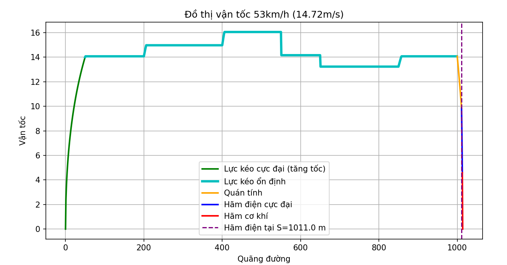

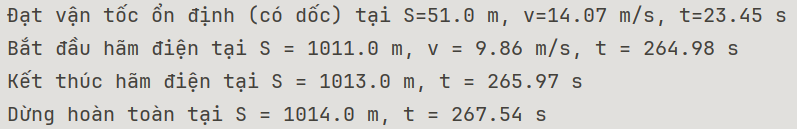

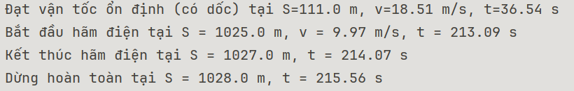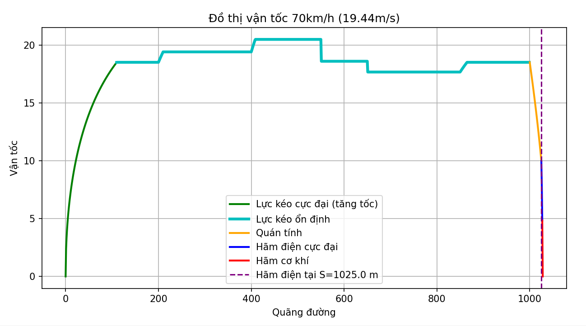

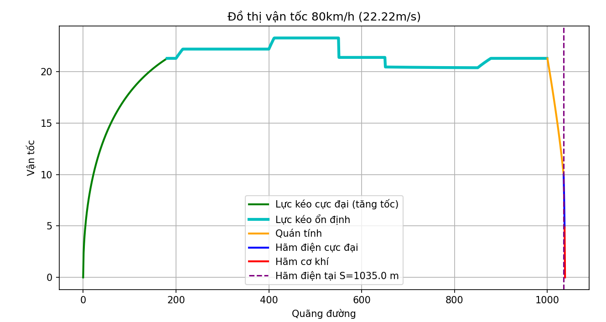

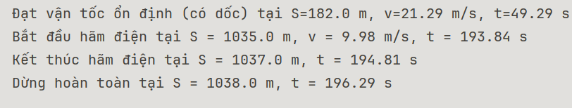

# Tài Liệu Tham Khảo

\[1\]. PGS.TS. Trịnh Lương Miên, *Giáo trình "* *HỆ THỐNG CHUYỂN ĐỘNG TÀU ĐIỆN METRO "* *– Khoa Điện- Điện tử, Trường đại học Giao Thông Vận Tải.*

\[2\]. NCS. Trịnh Lương Miên, “*Tạp chí KHOA HỌC GIAO THÔNG VẬN TẢI- Mô hình hóa quá trình chuyển động của tàu điện cao tốc” – Khoa Điện- Điện tử, Trường đại học Giao Thông Vận Tải.*
